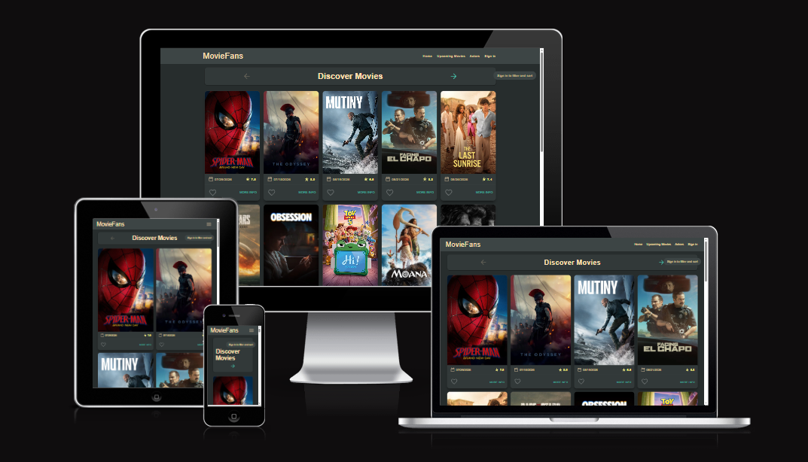
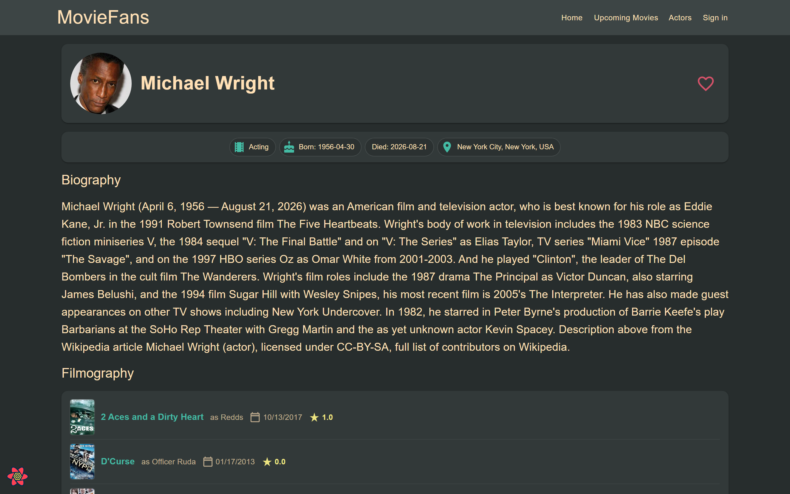
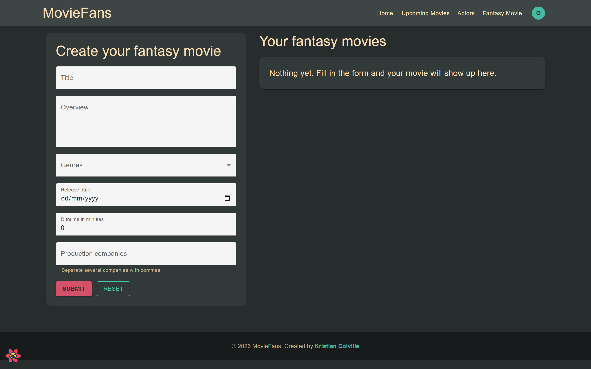
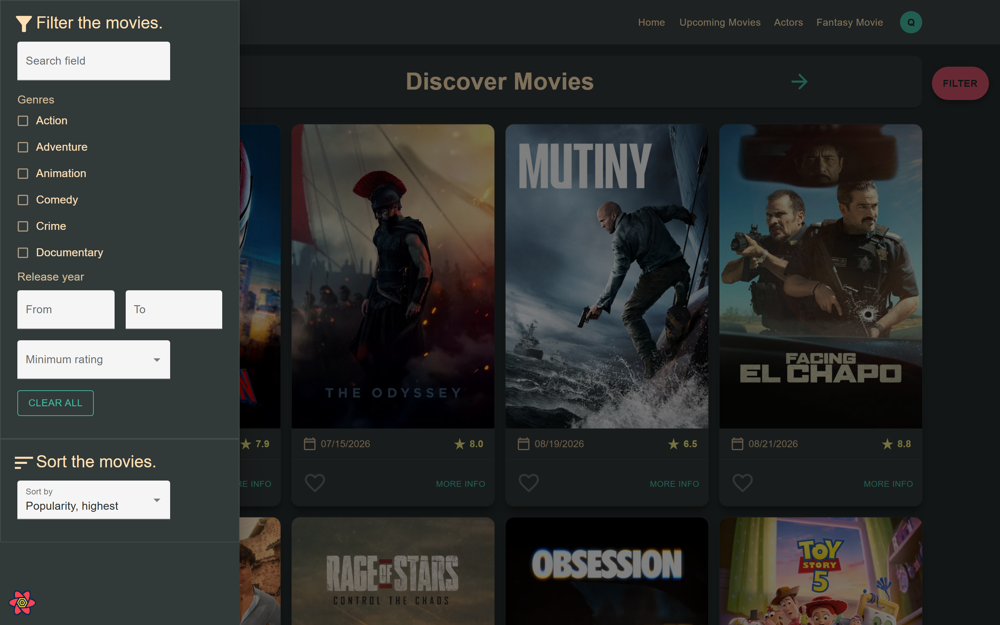
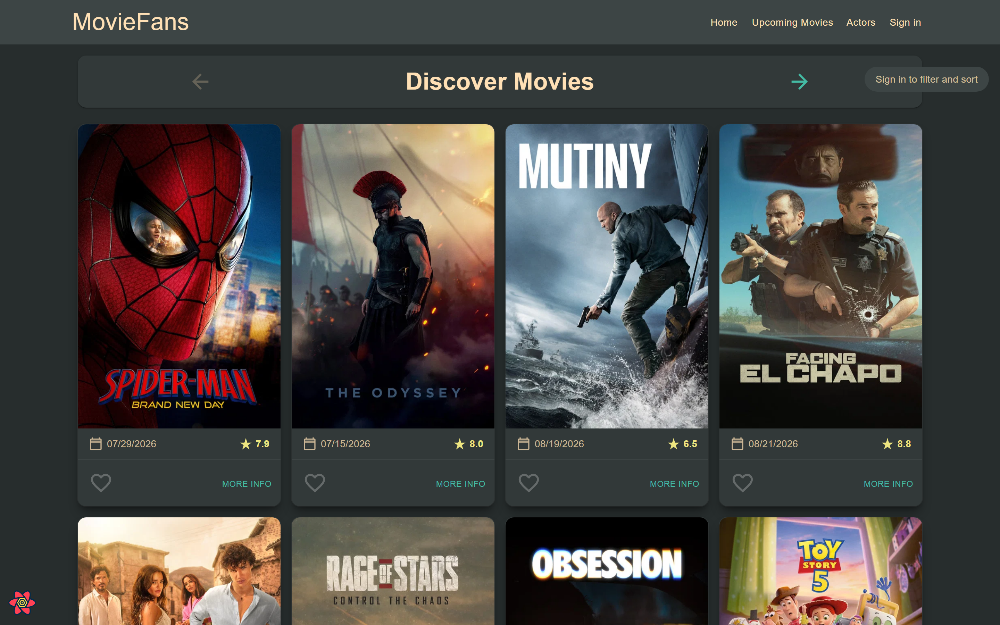
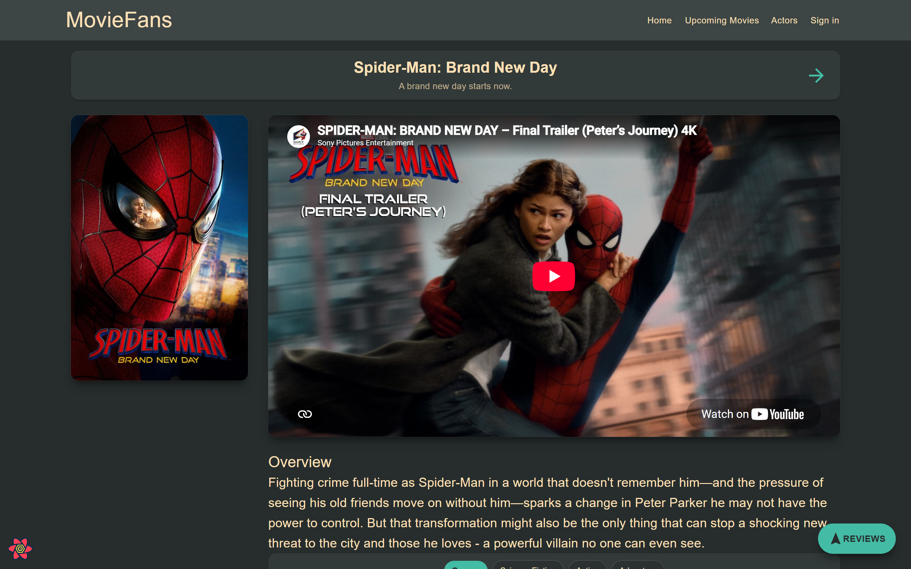
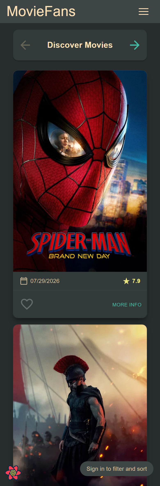

# MovieFans

Developer: Kristian Colville



Starting point: [github.com/KristianColville1/labMoviesApp](https://github.com/KristianColville1/labMoviesApp)

## Table of Contents

* [Project Goals](#project-goals)
  * [Personal Goals](#personal-goals)
* [User Experience (UX)](#user-experience-ux)
  * [Target Audience](#target-audience)
* [Design](#design)
  * [Color Scheme](#color-scheme)
  * [Typography](#typography)
  * [Layout](#layout)
  * [Icons](#icons)
  * [Styling with Tailwind and MUI](#styling-with-tailwind-and-mui)
* [Technologies &amp; Tools](#technologies--tools)
  * [Tech stack](#tech-stack)
  * [Data &amp; services](#data--services)
  * [Testing &amp; tooling](#testing--tooling)
  * [Code quality &amp; formatting](#code-quality--formatting)
  * [Front end &amp; docs](#front-end--docs)
* [Architecture](#architecture)
  * [Component Structure](#component-structure)
  * [Routing](#routing)
  * [State Management](#state-management)
* [Features](#features)
  * [Release 1](#release-1)
  * [Release 2](#release-2)
  * [Release 3](#release-3)
  * [Release 4](#release-4)
* [Data](#data)
  * [TMDB](#tmdb)
  * [Supabase Schema](#supabase-schema)
  * [Row Level Security](#row-level-security)
* [Testing](#testing)
  * [Manual Testing](#manual-testing)
  * [End-to-end Tests](#end-to-end-tests)
  * [Storybook](#storybook)
  * [Accessibility](#accessibility)
* [Bugs](#bugs)
  * [Bug Details](#bug-details)
* [Releases](#releases)
  * [Overview](#overview)
  * [Git Workflow](#git-workflow)
  * [Development Strategy](#development-strategy)
    * [Git Scope &amp; Branching](#git-scope--branching)
  * [Release Results](#release-results)
    * [Release 1](#release-1-1)
    * [Release 2](#release-2-1)
    * [Release 3](#release-3-1)
    * [Release 4](#release-4-1)
* [Development &amp; Deployment](#development--deployment)
  * [Version Control](#version-control)
  * [Cloning the Repository](#cloning-the-repository)
  * [Environment Variables](#environment-variables)
  * [Running Locally](#running-locally)
  * [Container &amp; CI](#container--ci)
  * [Bunny Magic Containers](#bunny-magic-containers)
  * [Usage](#usage)
* [Credits](#credits)

---

## Project Goals

MovieFans is a movie discovery single page application built on The Movie Database (TMDB) API. It extends the Movies app from the labs, and was developed in four releases, each one adding features from the next band of the grading spectrum. The application will:

- **Deliver a responsive, branded UI** using Tailwind for styling and MUI for structure, with a custom colour palette, an animated mobile nav, and a card grid that reflows from five columns down to one.
- **Add Actors as a second data entity** with a paginated list view and a detail page carrying a biography and filmography, reached through its own parameterised route.
- **Hyperlink the data in a full loop** so a movie leads to its cast, an actor leads to their filmography, and a film in that filmography leads back to a movie detail page.
- **Search and filter the whole catalogue** by genre, release year range, minimum rating and sort order, pushed into the TMDB discover endpoint as query parameters rather than applied to the page on screen.
- **Let users build personal collections** of favourite movies, favourite actors, a watch list and their own fantasy movies, each on its own private page.
- **Separate public from private** with Supabase email and password sign in, a route guard, and the filter drawer reserved for signed in users as the premium feature.
- **Persist every collection in Supabase Postgres** with the schema kept in the repository, migrations generated by the Supabase CLI, and row level security so a user reads and writes only their own rows.
- **Keep the codebase maintainable** with TypeScript in strict mode, an atomic design structure, path aliases in place of relative traversal, JSDoc throughout and Storybook stories for the components.
- **Test, containerise and deploy** with an end to end Playwright suite, a Docker image served by nginx, and a GitHub Actions workflow that publishes to GHCR and rolls the deployed container.

By working through the bands in order and tagging the repository at the end of each, the project aims to deliver a movie app with a real backend and a deployment pipeline, rather than a larger front end alone.

### Personal Goals

As the developer, my goals for this project include:

- **Extending the lab app rather than rewriting it**, adding features in the order the bands set out, so each stage builds on a working application instead of a half finished one.
- **Learning react-query properly**, in particular the split between server state that is fetched and cached and client state that lives in context.
- **Making Tailwind and MUI work together** instead of choosing between them, by understanding CSS layers well enough that utility classes win without per component overrides.
- **Treating the database as code**, keeping the schema in the repository and generating migrations from it, with no change made in the dashboard that is not reflected in a file.
- **Understanding row level security as the real security boundary**, since the Supabase key is public by design, and verifying each table with two separate accounts.
- **Writing tests that drive the real application** in a browser, covering sign up, sign in, the private route redirect, pagination, filtering and the fantasy movie.
- **Applying container and deployment skills** from the other modules on the course to take the app from a local dev server to a live URL.
- **Documenting the work honestly**, including the bugs found and fixed, the ones still open, and the features left out on purpose.

These goals guide an incremental approach that meets the brief while leaving the codebase typed, tested, deployed and readable to someone seeing it for the first time.

---

## User Experience (UX)

MovieFans is built for people who want to browse films, follow the people who make them, and keep track of what they mean to watch. Browsing is open to everyone, so a visitor can page through popular and upcoming movies, open a film for its trailer, overview and reviews, and follow the cast through to an actor and back. Signing in adds the filter drawer, the sort control and the personal collections, which persist between visits.

### Target Audience

MovieFans is aimed at anyone who watches films and wants a better way to find and organise them. The main audiences include:

- **Casual browsers:** People who want to see what is popular or coming soon, open a film and watch the trailer, without creating an account first.
- **Film fans who curate:** Users who want a record of what they love and a separate list of what they still mean to watch, and expect both to be there next time.
- **People who follow actors rather than titles:** Viewers who start from a performer, read the biography and work through the filmography to find their next film.
- **Users searching with criteria:** People who know they want a genre, a release window or a minimum rating, and want the catalogue narrowed to it rather than scrolled.
- **Aspiring creators:** Users who like the idea of pitching their own film, and use the fantasy movie page to record a title, overview, genres, release date, runtime and production companies.
- **Users on the go:** People browsing from a phone, where the nav collapses to a menu and the cards drop to a single column.

The app is designed so that browsing works for anyone who lands on it, while an account is what turns it from a catalogue into something personal.

---

## Design

The app is dark by default, on the reasoning that a wall of film posters reads better against a dark ground than a light one, and that a cinema listing is the kind of thing people scroll in the evening. The posters supply the colour, so the interface around them stays muted and the accents are kept for the things a user acts on.

### Color Scheme

The palette was generated with [Coolors](https://coolors.co/) and is registered as a `@theme` block in `src/index.css`, which is what turns each colour into Tailwind utilities such as `bg-jet-black` and `text-navajo-white`.

| Colour         | Hex         | Role                                                             |
| -------------- | ----------- | ---------------------------------------------------------------- |
| Jet Black      | `#272d2d` | The page ground, set on`body`                                  |
| Surface        | `#323939` | Cards and panels sitting on the ground                           |
| Surface Raised | `#3d4545` | Drawers, menus and anything sitting on a card                    |
| Navajo White   | `#ffe0b5` | Body text and headings, warm rather than plain white             |
| Ocean Mist     | `#44bba4` | The primary accent, used for actions and active states           |
| Magenta Bloom  | `#d35269` | The secondary accent, used for favourites, toasts and the filter |
| Pale Amber     | `#ede580` | Ratings and highlights                                           |

The three greys are deliberately close together. Depth is carried by small steps in value rather than by borders or shadows, so a card reads as raised without being outlined.

Two decisions worth recording. Text is Navajo White rather than pure white, because a warm off white against a near black is easier to read for long and keeps the interface from feeling clinical. Inputs invert instead of tinting: they sit on a near white ground with dark text, since a form field that matches its card is hard to find and a tinted one was tried and read as disabled.

### Typography

There is no web font. The app uses the system stack, declared on `body`:

```css
font-family: system-ui, -apple-system, "Segoe UI", Roboto, Helvetica, Arial, sans-serif;
```

Each visitor gets the interface font of their own platform, which costs no network request and never flashes unstyled text on load. MUI's own default is Roboto, which it expects to be installed or linked; it is neither here, so the stack above is what actually renders rather than what a stock MUI app would fall back to.

Weight and size do the work instead of a second family. Headings are the MUI `Typography` scale, card titles are set tighter than body text so a grid of them stays scannable, and supporting detail such as release dates and runtimes drops to a smaller size at reduced opacity rather than a different colour.

### Layout

The site is a centred column. `max-w-7xl` with `mx-auto` and horizontal padding is applied to the header, the page content and the footer, so all three line up and the content stops widening on a large monitor instead of stretching a row of cards across it.

Listings are an MUI `Grid` that steps through five widths:

| Breakpoint | Columns |
| ---------- | ------- |
| `xs`     | 1       |
| `sm`     | 2       |
| `md`     | 3       |
| `lg`     | 4       |
| `xl`     | 5       |

The page furniture follows the same idea. The header carries the brand, the navigation and the account menu, collapsing on small screens into a burger that slides the navigation down. The filter drawer opens from a floating button rather than taking permanent space beside the results, which keeps the full width for posters and works the same on a phone as on a desktop. The footer is on every page. Detail pages lead with the poster and title, then the trailer, then the overview, so the thing a visitor came for is above the fold and the supporting material is below it.

### Icons

Icons come from [MUI Icons](https://mui.com/material-ui/material-icons/), which ships with the component library, so there is no second icon source to keep in step.

- **Favorite** and **FavoriteBorder** for favourites, filled when set and outlined when not, on both movies and actors
- **PlaylistAdd** and **PlaylistAddCheck** for the watch list, toggling on the same principle
- **FilterAlt** and **Sort** for the filter drawer and its sort control
- **ArrowBack**, **ArrowForward**, **ChevronLeft** and **ChevronRight** for paging the lists and walking between films
- **StarRate** for ratings, **AccessTime** for runtime, **CalendarMonth** for release dates, **Business** for production companies
- **Cake** and **Place** for an actor's birthday and birthplace, **Theaters** for their credit count, **RateReview** for reviews, **Delete** for removal

Paired outlined and filled icons are used for anything that toggles, so state is legible without a label or a colour change alone.

### Styling with Tailwind and MUI

**Tailwind styles, MUI structures.** The MUI components stay, keeping their behaviour, accessibility and keyboard handling, and are styled with `className` rather than replaced with plain elements or overridden through `sx`.

Getting that to work takes one piece of setup. Tailwind puts its utilities in `@layer utilities`, and layered CSS always loses to unlayered CSS, so MUI's Emotion styles would beat every utility class no matter how specific. The fix is to put MUI's output in a layer too, and then declare the order:

```css
@layer theme, base, mui, components, utilities;
```

That line is the first in `src/index.css`, and `src/index.tsx` wraps the app in `StyledEngineProvider` with `enableCssLayer` so MUI emits into the `mui` layer. Utilities are declared last and win, with no `!important` anywhere. `enableCssLayer` needs MUI 5.16 or newer, which is why the project runs 5.18.

Two things follow from it. Some MUI props set colour themselves and beat inherited colour, so `IconButton` and `SvgIcon` take `color="inherit"` and a Tailwind class on the parent drives the colour instead. Components that render an inner surface need their own slot prop rather than a class on the outside, for example a `Drawer` styled through `PaperProps`.

`.storybook/preview.tsx` carries the same provider and imports the same stylesheet, so a component looks identical in Storybook and in the app.

---

## Technologies & Tools

### Tech stack

- **Front end:** React 18 with TypeScript 5, built by Vite 5
- **UI:** MUI 5 for structure, Tailwind 4 for styling, MUI Icons for iconography
- **Data:** The TMDB REST API, with react-query v3 holding the server state cache
- **Auth:** Supabase email and password, session held in context, guarded routes
- **Persistence:** Supabase Postgres, declarative schema and generated migrations, row level security per table
- **Routing:** react-router-dom v6, public and private route sets under a single guard
- **Forms:** react-hook-form for the search, sign in, fantasy movie, review and profile forms
- **Tests:** Playwright, driven by a small custom runner rather than its test runner
- **Docs:** Storybook 8, with a story beside each presentational component
- **Infra:** Docker (Node build stage, nginx runtime), GitHub Actions to GHCR, Bunny Magic Containers

### Data & services

- [The Movie Database](https://developer.themoviedb.org/docs) - The source of every movie, genre, actor, credit, image, trailer and review in the app. All requests go through `src/api/tmdb-api.ts`.
- [react-query](https://react-query-v3.tanstack.com/) - Server state caching, loading and error handling. Configured with a six minute stale time and no refetch on window focus, so paging back through a list is served from the cache rather than refetched.
- [Supabase](https://supabase.com/) - The backend. Provides authentication, the Postgres database behind the personal lists, and the row level security that scopes every row to its owner.
- [@supabase/supabase-js](https://www.npmjs.com/package/@supabase/supabase-js) - The browser client, created once in `src/storage/supabaseClient.ts` and failing loudly when its environment variables are missing.
- [Supabase CLI](https://supabase.com/docs/guides/local-development) - Generates migrations from the declarative schema files and applies them to the linked project through the `db:` scripts.
- [react-hook-form](https://react-hook-form.com/) - Form state and validation, used by every form in the app.

### Testing & tooling

- [Playwright](https://playwright.dev/) - End to end browser automation. Six tests cover signing up, signing in with a private route redirect and sign out, the signed out movie to actor loop, creating and deleting fantasy movies, paging through discover with a genre filter, and the catalogue wide filter.
- **Custom test runner** - The suite runs on `e2e/harness.mjs`, roughly a hundred lines over `chromium.launch()`, with `e2e/run.mjs` holding the tests. The Playwright test runner would not collect specs in this environment, so the library is used directly. The harness handles test registration, assertions, polling and the shared sign in helpers.
- [Vite](https://vitejs.dev/) - Dev server on port 3000 and the production build. The path aliases are mirrored here from `tsconfig.json`, and both must be kept in step.
- [@vitejs/plugin-react](https://www.npmjs.com/package/@vitejs/plugin-react) - React fast refresh and JSX transform.
- [@tailwindcss/vite](https://tailwindcss.com/docs/installation/using-vite) - The Tailwind 4 plugin, which replaces the PostCSS setup earlier versions needed.
- [Docker](https://www.docker.com/) - Two stage image, Node to build and nginx to serve. Also required locally by `supabase db diff`, which runs the diff in a container.

### Code quality & formatting

- [TypeScript](https://www.typescriptlang.org/) - Strict mode, with `noUnusedLocals` and `noUnusedParameters` enabled, so dead bindings fail the build rather than accumulate.
- [ESLint](https://eslint.org/) - Linting through [@typescript-eslint](https://typescript-eslint.io/), with [eslint-plugin-react-hooks](https://www.npmjs.com/package/eslint-plugin-react-hooks) for the rules of hooks, [eslint-plugin-react-refresh](https://www.npmjs.com/package/eslint-plugin-react-refresh) for fast refresh safety and [eslint-plugin-storybook](https://www.npmjs.com/package/eslint-plugin-storybook) for the stories. Run with `--max-warnings 0`, so a warning is a failure.
- **Path aliases** - No relative traversal anywhere in `src`. Every folder has an alias, declared in `tsconfig.json` and mirrored in `vite.config.ts`. `@typings/*` points at `src/types` because TypeScript reserves `@types` for declaration packages.
- **JSDoc** - Every component and every API function carries a docstring, with `@param` for each argument and `@returns JSX.Element` on components.
- **Formatting** - The repository is four space indented and has no Prettier configuration, so formatting is kept by hand rather than by a tool. Running Prettier without a config would reformat every file to its two space default.

### Front end & docs

- [React](https://react.dev/) - The framework the whole application is built on, with function components and hooks throughout.
- [TypeScript](https://www.typescriptlang.org/) - Typed JavaScript, used across the app, the tests and the build configuration.
- [MUI](https://mui.com/) - The component library providing the structure: cards, grids, drawers, dialogs, menus, tables and the typography scale.
- [MUI Icons](https://mui.com/material-ui/material-icons/) - The icon set behind the favourite, watch list, navigation and pagination controls.
- [Emotion](https://emotion.sh/) - The styling engine MUI ships with. It is wrapped in `StyledEngineProvider` with `enableCssLayer` so its output lands in a named CSS layer (see Design → Styling with Tailwind and MUI).
- [Tailwind CSS](https://tailwindcss.com/) - Utility classes carrying the styling, with the brand palette registered as a `@theme` block in `src/index.css`.
- [Storybook](https://storybook.js.org/) - The component library, with stories kept beside their components rather than in a separate folder. Thirty nine stories cover the presentational components.
- [YouTube](https://www.youtube.com/) - Embeds the trailer on the movie detail page, using the video key returned by TMDB.
- [Bunny Magic Containers](https://bunny.net/) - Hosts the deployed application.

---

## Architecture

### Component Structure

Components follow **atomic design**, with each layer given its own alias so an import states which layer it is reaching into. New components are placed in the right layer when they are written rather than sorted afterwards.

| Layer          | Rule                                              | Count |
| -------------- | ------------------------------------------------- | ----- |
| `@atoms`     | A single element or action, no domain knowledge   | 9     |
| `@molecules` | One domain concept, presentational, no fetching   | 12    |
| `@organisms` | Owns state or fetches data                        | 15    |
| `@templates` | Page layout scaffolds, arranging the layers below | 4     |

Pages under `src/pages` are thin. They read the route parameters, call a hook or a query, and hand the result to a template, which keeps the layout in one place and out of the routing. The rest of `src` divides along the same lines: `api` for the TMDB module, `contexts` for client state, `storage` for the Supabase clients and stores, `hooks` for `useFiltering` and `useMovie`, `tools` for helpers such as the date formatter, and `types` for the shared interfaces.

### Routing

Routing is `react-router-dom` v6. The private routes sit inside a single `<Route element={<PrivateRoute />}>` wrapper rather than each guarding itself, so the guard exists in one place and a new private page is added by moving it inside that block.

| Route                  | Access  | Page                                             |
| ---------------------- | ------- | ------------------------------------------------ |
| `/`                  | Public  | Discover, paginated and filterable               |
| `/movies/upcoming`   | Public  | Upcoming releases                                |
| `/movies/:id`        | Public  | Movie detail, trailer, cast, posters and reviews |
| `/actors`            | Public  | Actors list                                      |
| `/actors/:id`        | Public  | Actor biography and filmography                  |
| `/reviews/:id`       | Public  | A single full review                             |
| `/login`             | Public  | Sign in and sign up                              |
| `/error`             | Public  | Server error page                                |
| `/profile`           | Private | Display name and password                        |
| `/movies/favourites` | Private | Favourite movies                                 |
| `/movies/watchlist`  | Private | Watch list                                       |
| `/actors/favourites` | Private | Favourite actors                                 |
| `/fantasy`           | Private | Fantasy movie form and list                      |
| `/fantasy/:id`       | Private | A single fantasy movie                           |
| `/reviews/form`      | Private | Write a review                                   |
| `*`                  | Public  | 404                                              |

`/movies/:id`, `/actors/:id`, `/reviews/:id` and `/fantasy/:id` are the parameterised routes, and the hyperlinking runs between them: a movie links to each cast member, an actor links to every credit in their filmography, and each credit links back to a movie. Unknown addresses render the 404 page in place rather than redirecting home, so the address that failed stays in the bar.

### State Management

State is split by where it comes from.

**Server state** is owned by react-query. Every TMDB call is a query keyed by its arguments and its page, so paging forward and back is served from the cache, and `keepPreviousData` holds the current page on screen while the next one loads rather than flashing a spinner. Loading and error states come from the query rather than being tracked by hand.

**Client state** lives in three contexts, composed in `src/contexts/allContext.tsx` rather than nested in the app, so adding a fourth is one line in an array:

- `authContext` holds the Supabase session and the sign in, sign up, sign out, display name and password actions. Its `isLoading` starts `true` deliberately, because without it a private route bounces a signed in user to the login page on every refresh while the session is still being restored.
- `moviesContext` holds the favourites, favourite actors, watch list, fantasy movies and reviews, along with the actions that add to and remove from each.
- `toastContext` exposes a single `triggerToast` so any component can raise a confirmation without owning a snackbar of its own.

**Persisted state** goes through `src/storage`, one module per table, each reading and writing against the signed in user. The stores return an empty result rather than throwing when a request fails, which keeps the UI standing but means a broken policy shows as an empty list, so the network tab is the place to check rather than the console.

---

## Features

The releases below describe what the app can do at each stage. The development record, with dates and tags, is under [Releases](#releases).

### Release 1

The foundation. Actors are added as a second data entity and the app stops being a single list of films.

- **Discover** lists popular films as a grid of poster cards, each showing the title, release date, rating to one decimal and a favourite control.
- **Actors** is a second list view of its own, with a name filter in a drawer.
- **Actor detail** carries the portrait, department, birthday, birthplace, biography and full filmography, sorted newest first with the role played in each film.
- **Billed cast** appears on every movie page, capped at twelve, each member linking to their actor page.
- **The navigation loop closes here.** A film leads to its cast, a cast member to their actor page, the filmography back to another film, and around again. Both `/movies/:id` and `/actors/:id` are parameterised routes.
- **Sorting** by title A to Z, release date, rating or popularity.
- **Fantasy Movie** lets a signed in user write their own film with a title, overview, genres, release date, runtime and production companies, then see it as a card and open it on its own page.





### Release 2

The app learns who you are, and the catalogue becomes navigable rather than just long.

- **Pagination** on discover, upcoming and actors, capped at the five hundred pages TMDB will serve. The previous page stays on screen while the next loads instead of blanking.
- **Multi criteria search** in a drawer: title text, a scrollable group of genre checkboxes, a release year from and to, a minimum rating, and a clear all.
- **Accounts.** Sign up and sign in on one toggled form, backed by Supabase email and password.
- **Public and private routes.** The personal pages sit behind a guard, and a visitor sent to sign in is returned to the page they wanted rather than dropped on the home page.
- **Premium functionality.** The filter and sort drawer is for signed in users; anonymous visitors get an invitation in its place. The private navigation entries are hidden from them too.
- **Favourite actors**, with the same toggle on an actor card as a film has, and a page of their own.
- **Everything saved is now persisted** to Supabase against the signed in account, so favourites, favourite actors and fantasy movies survive closing the tab and follow the user to another machine.



### Release 3

Release 3 added no user facing features. It made the app deployable, which is the capability it delivered.

- **The app runs as a container**, built to static files and served by nginx, with the single page fallback that lets a deep link such as `/movies/123` survive a refresh.
- **Every push builds and publishes an image** to the GitHub Container Registry, tagged by commit.
- **The live site rolls automatically** onto each new image.

### Release 4

The largest release, and the one that makes the app feel finished.

- **Search filters the whole catalogue.** Genre, year range, rating and sort are sent to TMDB rather than applied to the twenty rows on screen, so the results and the page count are both real.
- **Trailers and posters.** The movie page leads with the trailer, followed by the overview and a scrollable carousel of stills and alternate posters.
- **Paging from the header.** Arrows page the lists, and on a movie page they walk the list you arrived from, so you can move through a filtered set without going back. On a deep link, where there is no list to walk, they are hidden.
- **A watch list**, separate from favourites, with its own toggle and page, for films you mean to get to.
- **A profile page** for the display name and password, with the account email moved into an avatar menu that also holds the personal lists.
- **Toasts** confirm every add and remove, top centre, so an action on a card is acknowledged without moving the page.
- **Reviews** open from the rating chip on a film, in a styled table, with a full review on its own page that a signed out visitor can read. A signed in user can write their own, which is saved against their account and appears at the top of that film's reviews marked as theirs.
- **Error pages.** A 404 for unknown addresses, shown in place so the address that failed stays in the bar, and a 500 for a server error.
- **Presentation.** The site was named MovieFans, given a fixed width column and a tighter grid that steps from five posters a row down to one, a footer on every page, and a mobile navigation that slides down from a burger.







---

## Data

Two sources. Everything about films and the people in them comes from TMDB and is read only. Everything a user saves is theirs, and lives in Supabase Postgres.

### TMDB

All requests go through `src/api/tmdb-api.ts`, one function per endpoint, each checking the response and throwing so react-query can surface the failure.

| Function              | Endpoint                                 | Used for                                  |
| --------------------- | ---------------------------------------- | ----------------------------------------- |
| `getMovies`         | `/discover/movie` or `/search/movie` | The home page, filtered, sorted and paged |
| `getMovie`          | `/movie/{id}`                          | The movie detail page                     |
| `getUpcomingMovies` | `/movie/upcoming`                      | The upcoming releases page                |
| `getGenres`         | `/genre/movie/list`                    | The genre checkboxes                      |
| `getMovieImages`    | `/movie/{id}/images`                   | The poster carousel                       |
| `getMovieVideos`    | `/movie/{id}/videos`                   | The trailer embed                         |
| `getMovieReviews`   | `/movie/{id}/reviews`                  | The reviews table                         |
| `getMovieCredits`   | `/movie/{id}/credits`                  | The billed cast                           |
| `getActors`         | `/person/popular`                      | The actors list                           |
| `getActor`          | `/person/{id}`                         | The actor biography                       |
| `getActorCredits`   | `/person/{id}/movie_credits`           | The filmography                           |

`getMovies` picks its path. With no title it calls `/discover/movie` and sends genre, year range, rating and sort as query parameters, so the whole catalogue is filtered and the page count is right. With a title it calls `/search/movie`, which takes a query string and nothing else, so a title narrows the page it returns rather than combining with the other criteria. Genres are combined with OR, because TMDB spells OR as a pipe in `with_genres`.

### Supabase Schema

As part of my independent learning I explored Supabase and implemented it here. It was handy enough to get going with, and there is a lot to gain from the free tier. A good deal comes out of the box, authentication in particular, which would otherwise have been a project of its own before any of the personal lists could be stored against a user. It is definitely worth exploring on a future project.

The schema is declarative. The files under `supabase/schemas` are the source of truth, `supabase db diff` generates a migration from them and `npm run db:push` applies it, so nothing is created by hand in the dashboard.

| Table                | Key                     | Columns                                                                                                         |
| -------------------- | ----------------------- | --------------------------------------------------------------------------------------------------------------- |
| `favourites`       | `(user_id, movie_id)` | `created_at`                                                                                                  |
| `must_watch`       | `(user_id, movie_id)` | `created_at`                                                                                                  |
| `favourite_actors` | `(user_id, actor_id)` | `created_at`                                                                                                  |
| `fantasy_movies`   | `id` uuid             | `title`, `overview`, `genre_ids`, `release_date`, `runtime`, `production_companies`, `created_at` |
| `reviews`          | `id` uuid             | `movie_id`, `author`, `content`, `rating`, `agree`, `created_at`                                   |

The composite key on the three list tables means a user cannot favourite the same film twice without any check in the app. Every table defaults `user_id` to `auth.uid()`, so the client never sends an owner, and references `auth.users` with `on delete cascade`, so deleting an account takes its rows with it.

### Row Level Security

The Supabase publishable key ships in the bundle and is public by design, so row level security is the only thing keeping one user out of another's rows. Every table has it enabled with a policy per operation: select and delete match `auth.uid()` against the row's owner, and insert checks the row being written, which is what stops a user creating a row owned by somebody else. The three list tables get select, insert and delete, since a favourite is added or removed but never edited, and `reviews` gets the same three. `fantasy_movies` also gets update, because a fantasy movie is content its owner can change.

Each table was checked with two accounts, creating rows as one and confirming the other could neither see nor delete them.

---

## Testing

### Manual Testing

Everything the automated suite does not reach was checked by hand: the lists and detail pages, favourites, the watch list, the fantasy movie, the profile page, the reviews, the error pages and the layout at phone and tablet widths. Row level security was checked with two separate accounts, signing in as each in turn and confirming neither could see or remove the other's rows.

This was done in Firefox and Google Chrome, looking for anything that rendered or behaved differently between the two.

There are no unit tests. The app has little logic that is not either a React component or a call to an API, and the two pieces worth testing in isolation, the filter hook and the sort function, are both exercised through the browser tests where a regression would actually show.

### End-to-end Tests

**The runner is custom.** The Playwright test runner would not collect specs in this environment, failing inside its own internals before any test ran. The library works fine, so the suite is built directly on it: `e2e/harness.mjs` provides what the runner would have and `e2e/run.mjs` holds the tests.

What the harness does:

- Registers tests into an array, with `assert` and `assertEqual` as the whole assertion library.
- Polls rather than sleeps, re-running a check until it passes and reporting the last value it saw on timeout.
- Gives each test a fresh browser context, so a session never leaks into the next one.
- Fails a test on any uncaught page error, so a silent white screen is a failure rather than a pass.
- Skips rather than fails when no test account is configured, so a fresh clone runs the public test instead of reporting five red failures.
- Reuses one fixed account for the sign up test and falls through to signing in when it exists, so repeat runs do not fill the project with users.
- Clears the fantasy movies before and after, so the account ends where it started.

One detail worth recording, because it cost time: card counts come from `.MuiCardMedia-root` and never `.MuiCard-root`, since the filter drawer renders two Cards of its own.

| # | Test                                                               | What it proves                                                                                                |
| - | ------------------------------------------------------------------ | ------------------------------------------------------------------------------------------------------------- |
| 1 | signs up an account and lands signed in                            | Sign up works, the session is live afterwards, and the private navigation appears                             |
| 2 | signs in, opens a private route, signs out again                   | The guard redirects while anonymous, opens once signed in, survives a reload, and closes again after sign out |
| 3 | a signed out visitor can walk movie to actor and back              | Public browsing, both parameterised routes, and the full hyperlink loop, with no account                      |
| 4 | creates two fantasy movies, opens one on its own page, deletes one | The fantasy movie path end to end, including that a second creation adds rather than replaces                 |
| 5 | pages through discover and narrows it by genre                     | Pagination moves the results, a genre filter changes them, and clear all restores them                        |
| 6 | a genre filter narrows the whole catalogue, not the page on screen | Filtering happens server side: a filtered page one and page two each hold a full twenty results               |

Test 2's reload step and test 6 both exist because of bugs that reached the app, described under [Bugs](#bugs).

`HEADED=1 npm test` runs it visibly, and `BASE_URL` points it at the deployed site rather than localhost.

### Storybook

Storybook is where the components are checked. Thirty nine story files hold fifty two entries. Most components have a single story with representative data, and where a second state is worth looking at it gets one: the filter drawer open and closed, a list with nothing in it, a movie with no trailer, the pagination capped at its last page, the header as an anonymous visitor sees it, and the error notice as both a 404 and a 500.

Stories live beside their component rather than in a folder of their own, so a component and its states are edited together. `npm run build-storybook` has to pass alongside the build, the lint and the type check, so a component that no longer renders in isolation fails early. Storybook loads the same provider and stylesheet as the app, so a component looks the same in both.

Two stories fetch from TMDB when they mount, because the components behind them fetch their own data, so those two need an API key to render.

`npm run storybook` opens the library on port 6006.

### Accessibility

An accessibility pass is the clearest piece of outstanding work in the project, so what follows is what is in place and what is not, rather than a claim that the app is accessible.

**In place.**

- Keeping MUI components rather than replacing them means the keyboard behaviour comes with them: the drawer traps focus and closes on Escape, menus move on arrow keys, and the pagination, selects and checkboxes are all operable without a mouse.
- Every icon only control carries an `aria-label`, and the fantasy movie delete names the film it deletes rather than saying "delete".
- Every form control is a labelled field with its label properly associated, and validation messages are attached to their field rather than only coloured.
- The sign in failure is a live region, so a screen reader announces it.
- `lang` is set, the page title is real, and the images that are `` elements have alt text.

**Not in place.**

- No `<main>` landmark and no skip link, so a keyboard user tabs through the header on every page.
- The heading structure is inverted. Page titles are `h3` and the only `h1` elements sit inside the filter drawer.
- The poster grids have no text alternative, because cards render their poster as a CSS background rather than an image. This is the most significant gap.
- Every card's link is announced as "More Info", twenty times a page.
- The navigation is buttons rather than links, so it cannot be opened in a new tab.
- Focus is not moved on route change, reduced motion is not honoured by the smooth scrolling, and contrast has not been measured on the smaller muted text.
- No automated checking: no axe, no Lighthouse budget, no Storybook accessibility addon.

The next piece of work is the landmark, the heading levels and the nested control, followed by giving the cards a real accessible name, which is the change that would make the app usable rather than merely navigable.

---

## Bugs

### Bug Details

Bugs found and fixed during development. Several came out of an adversarial review partway through, where the app was gone over looking for features that were claimed but thin.

| Bug                                                                                                                            | Cause                                                                                                       | Fix                                                                                                                                                                                                      |
| ------------------------------------------------------------------------------------------------------------------------------ | ----------------------------------------------------------------------------------------------------------- | -------------------------------------------------------------------------------------------------------------------------------------------------------------------------------------------------------- |
| Filtering only narrowed the page on screen, so a genre plus a rating gave three cards above a page offering five hundred pages | The filter ran over the twenty rows already fetched                                                         | Criteria sent to the TMDB discover endpoint as query parameters, and the page resets with them. Test 6 keeps it fixed                                                                                    |
| All four header arrows were dead from base                                                                                     | Icon buttons with no handler                                                                                | The list arrows page; the movie arrows walk the list you arrived from and hide on a deep link                                                                                                            |
| The full review page was private, then white screened after sign in                                                            | Public data behind the guard, and the guard replaced the link's state, so the page destructured off nothing | Route made public, and it shows a not found notice when it arrives without a review                                                                                                                      |
| The review form crashed when visited directly                                                                                  | It read the film out of router state                                                                        | Redirects home, and the query only runs once there is a film                                                                                                                                             |
| Adding a review corrupted the list                                                                                             | An array spread into an object literal                                                                      | Appends properly                                                                                                                                                                                         |
| The heart on the movie header disagreed with the rest of the app                                                               | It read localStorage, a lab leftover                                                                        | Reads the context                                                                                                                                                                                        |
| The watch list was write only                                                                                                  | No page and no table                                                                                        | A toggle, a page and a table with row level security                                                                                                                                                     |
| The page moved but the results did not shift for filterremo                                                                    | The page number never reached the query                                                                     | A real parameter, and part of the cache key                                                                                                                                                              |
| Adding a filter silently changed the meaning of the others                                                                     | Pages indexed into`filterValues[0]` and `[1]`                                                           | Read and written by name                                                                                                                                                                                 |
| Smaller ones                                                                                                                   |                                                                                                             | An unclosed bracket in the rating label, ratings printed to full float, the lab app's "Option 3" and "Option 4" nav placeholders, a stray`console.log`, and a missing type import that broke the build |

---

## Releases

### Overview

The project is delivered in staged **releases** that map to the bands of the grading spectrum. Each release closes a band and is marked with an annotated tag on `main`, so the state of the app at every stage can be checked out and reviewed on its own. Release 1 established the foundation, adding Actors as a second data entity alongside the housekeeping the lab app needed. Release 2 adapted the app with pagination, a multi criteria search, Supabase authentication and the first backend persistence. Release 3 containerised the build and put it live. Release 4 was the largest, covering branding, layout, the trailer and carousel, the profile page, toasts, the watch list, the error pages and the fix that moved filtering off the page on screen and onto the server.

The bands do not map one to one onto the tags. Third party authentication is an Excellent band feature that was built early, in Release 2, because private routes were needed before anything could be stored per user, and the persistence that the Outstanding band asks for followed it in the same release for the same reason. The tags mark where work was closed rather than where a band began.

### Git Workflow

Typical commands for managing branches:

```bash
git checkout -b branch_name
git push --set-upstream origin branch_name
git checkout develop
git merge --no-ff branch_name
git push origin develop
```

### Development Strategy

The assignment is delivered in four iterations:

- **Release 1** the Good band
- **Release 2** the Very Good band
- **Release 3** the Excellent band
- **Release 4** the Outstanding band

#### Timeline

| Milestone            | Date              |
| -------------------- | ----------------- |
| Project Start        | August 9th, 2026  |
| Release 1 tagged     | August 12th, 2026 |
| Release 2 tagged     | August 17th, 2026 |
| Release 3 tagged     | August 26th, 2026 |
| Release 4 tagged     | August 27th, 2026 |
| Final Submission     | August 31st, 2026 |
| Approximate Duration | 3 weeks           |

#### Git Scope & Branching

The repo follows a **Git Flow** pattern with two long lived branches and short lived feature branches cut from `develop`:

- `main` production. Every push builds the image and rolls the deployed container. Never committed to directly.
- `develop` integration. Features merge here first, and once a band is settled `develop` is merged into `main` and tagged.
- `feature/<name>` one branch per discrete piece of work, cut from `develop` and merged back with `--no-ff` so the merge is recorded in history.

The typical loop:

```bash
git checkout develop
git pull
git checkout -b feature/good-band     # one branch per slice of work
# ... commits ...
git checkout develop
git merge --no-ff feature/good-band
git push origin develop
# when the band is closed:
git checkout main
git merge --no-ff develop
git tag -a base -m "Good band complete"
git push origin main --tags
```

The feature branches used in this repo were `feature/good-band`, `feature/new-chars`, `feature/deploy` and `release-4`, with `readme` carrying the documentation. Branches were kept on `origin` after merging rather than deleted, so `git branch -a` shows the incremental work as evidence.

Commits are one line and state the purpose of the session, and were made per file or per closely related group of files rather than in large batches. The history runs to just under two hundred commits across the four releases, starting from `ce0b683`, the lab app copied in unchanged as the base project.

The tags on `main`:

- `base` Release 1 closed, the Good band
- `adapt` Release 2 closed, the Very Good band
- `release-3` Release 3 closed, the Excellent band
- `release-4` Release 4 closed, the Outstanding band

### Release Results

#### Release 1

Release 1 established the foundation of the application on top of the lab app.

**Housekeeping:** Path aliases replaced relative traversal across `src`, components were restructured into atomic design layers with an alias per layer, Tailwind and the brand palette were introduced, the Vite starter assets were removed and favicons added.

**Data model:** Actors were added as a second data entity, with actor, cast and credits endpoints on the TMDB API module and the types to carry them.

**UI:** An actors list page with a name filter, an actor detail page with biography and filmography, and a billed cast section on the movie detail page. Each new presentational component was added with its Storybook story.

**Routing:** The actor detail page introduced a second parameterised URL, and the placeholder navigation entries from the lab app were replaced with real ones. The hyperlinking loop was closed here, so a movie leads to its cast, a cast member to their actor page, the filmography back to a movie, and around again.

**Functionality:** Additional sorting and filtering criteria were added to the filter drawer and wired through the discover, upcoming and favourites lists. The basic fantasy movie was built, with a form, a list, a card, a detail page on its own route, and the movie held in context and local storage at this stage.

#### Release 2

Release 2 adapted the app with the features of the Very Good band, and reached ahead into the Excellent and Outstanding bands where the work depended on it.

**Pagination:** A pagination control was added and a page number carried through to the discover, upcoming and actor queries. The react-query refetch interval was dropped so the cache serves repeat pages rather than refetching them.

**Search:** The multi criteria search was built into the filter drawer, adding genre, release year and rating conditions, with filter values read and written by name so the pages no longer index into them positionally.

**Auth:** Supabase email and password authentication was added, with the client failing loudly when its environment variables are missing, the session held in an auth context, a private route guard, a login page carrying both sign in and sign up, and the routes split into public and private sets. The signed in account is shown and the private navigation entries are hidden from anonymous visitors.

**Premium functionality:** Filtering and sorting were reserved for signed in users, so an anonymous visitor sees an invitation in place of the filter control.

**Favourites:** Favourite actors were added, with a toggle on the actor card and its own page, matching the existing favourite movies.

**Persistence:** The fantasy movies, favourites and favourite actors moved out of local storage into Supabase, loaded and written against the signed in user. The database is described as declarative schema files in the repository, with the initial migration generated from them and applied through the Supabase CLI.

**Testing:** Five end to end tests were added over the Playwright library.

#### Release 3

Release 3 took the app from a local dev server to a live URL.

**Container:** The application is built into an nginx image, with a Node stage that runs the Vite build and a runtime stage that serves the static output. The nginx config carries the single page fallback, so refreshing a deep link such as `/movies/123` returns the app rather than a 404, and sets long cache headers on the hashed assets while keeping `index.html` uncached so a deploy does not leave visitors on the old bundle.

**Continuous integration:** A GitHub Actions workflow builds and pushes the image to the GitHub Container Registry on every push to `main` and `develop`, tagging by full commit SHA and branch name rather than a moving tag. The three `VITE_` values are passed as build arguments, because Vite inlines them at build time, and the workflow was restructured to keep the build secrets out of the published image where possible.

**Deployment:** The published image is rolled onto Bunny Magic Containers by the last step of the same workflow.

#### Release 4

Release 4 was the largest of the four and covers the rich feature set the Outstanding band asks for.

**Filtering:** The most significant fix in the project. Search criteria had been applied to the twenty rows already on screen, so ticking a genre alongside a rating returned three cards above a pager still claiming five hundred pages. The criteria are now sent to TMDB as query parameters on the discover endpoint, the whole catalogue is filtered, the page resets with the query, and a sixth end to end test covers it.

**Branding and layout:** The app was renamed MovieFans, the brand returns home on click, the site was given a fixed width container and a tighter card grid, and the movie page was brought in line with the lists.

**Movie page:** A trailer embed and a poster carousel were added, along with the YouTube key lookup that feeds the trailer. The header arrows now page the lists, and on a movie page they walk the list the visitor arrived from, which is carried along with the link.

**Profile:** A profile page was routed behind the guard, with display name and password actions on the auth context, and the account email moved out of the navigation into an avatar menu.

**Watch list:** A toggling watch list icon, a page of its own, and a table with its policies, persisted against the signed in user.

**Toasts:** A toast context and provider were added and wired to the favourite, watch list and fantasy movie actions, rendered top centre in the brand colours. All three contexts are now composed in one place rather than nested in the app.

**Error handling:** 404 and 500 pages were added over a shared error notice panel, with unknown addresses showing the 404 rather than redirecting home.

**Reviews:** The reviews table and the full review view were styled, reviews open from the rating chip, and the review page was made public so a signed out visitor following the link is no longer bounced to sign in and left on a blank page.

**Other:** A site footer, an animated mobile navigation that slides down from a burger, a date helper for release dates, ratings shown to one decimal place, and the movie header heart read from context rather than local storage.

---

## Development & Deployment

### Version Control

I used [Visual Studio Code](https://code.visualstudio.com/) as a local repository and IDE & [GitHub](https://github.com/) as a remote repository.

1. Firstly, I needed to create a new repository on GitHub [react-movie-fans](https://github.com/KristianColville1/react-movie-fans).
2. I opened that repository on my local machine by copying the URL from that repository and cloning it from my IDE for use.
3. Visual Studio Code opened a new workspace for me.
4. I copied the Movies app from the labs in as the base project and committed it unchanged, so the starting point is visible in the history.
5. To push my newly created files to GitHub I used the terminal by pressing Ctrl + shift + `.
6. A new terminal opened and then I used the below steps.

   - `git add (name of the file)` *This selects the file for the commit*
   - `git commit -m "Commit message: (i.e. Initial commit)"` *Allows the developer to assign a specific concise statement to the commit*
   - `git push` *The final command sends the code to GitHub*

### Cloning the Repository

If you would like to clone this repository please follow the below steps.

Instructions:

1. Log into GitHub.
2. Go to the repository you wish to clone.
3. Click the green "Code" button.
4. Copy the URL provided under the HTTPS option.
5. Open your preferred IDE with Git installed.
6. Open a new terminal window in your IDE.
7. Enter the following command exactly: `git clone the-URL-you-copied-from-GitHub`.
8. Press Enter.
9. Run `npm install` to install the dependencies.
10. Create a `.env` file as described below, or the app will start but fail to fetch anything.

### Environment Variables

The app reads three values at build time. Vite only exposes variables prefixed with `VITE_` to the browser, so the prefix is required rather than a convention.

| Variable                          | Purpose                                                       |
| --------------------------------- | ------------------------------------------------------------- |
| `VITE_TMDB_KEY`                 | TMDB API key, used by every request in`src/api/tmdb-api.ts` |
| `VITE_SUPABASE_URL`             | The Supabase project URL                                      |
| `VITE_SUPABASE_PUBLISHABLE_KEY` | The Supabase publishable key                                  |

The Supabase publishable key is public by design and ends up in the bundle. Row level security is what keeps one user out of another user's rows, not the key.

The end to end suite reads two further values, `TEST_USER_EMAIL` and `TEST_USER_PASSWORD`, for the account it signs in with. These are deliberately not prefixed, so they never reach the browser bundle.

Vite reads `.env` once at startup, so the dev server needs restarting after any change to it.

### Running Locally

```bash
npm install
npm run dev
```

Open http://localhost:3000. Browsing works straight away; sign up from the account menu to unlock the filter drawer and the personal lists.

The other scripts:

```bash
npm run build           # type check, then build to dist
npm run lint            # eslint, no warnings allowed
npm run storybook       # component library on port 6006
npm run build-storybook # static storybook build
npm test                # end to end suite, needs the dev server already running
npm run db:push         # apply pending migrations to the linked Supabase project
```

`npm test` drives a real browser against the running app and does not start a server itself, so leave `npm run dev` running in another terminal. Set `HEADED=1` to watch it, or `BASE_URL` to point it at the deployed site instead of localhost.

### Container & CI

The app builds into an nginx image. The `VITE_` values are build arguments rather than runtime environment, because Vite inlines them into the bundle when it builds.

```bash
docker build \
  --build-arg VITE_TMDB_KEY=your_key \
  --build-arg VITE_SUPABASE_URL=your_url \
  --build-arg VITE_SUPABASE_PUBLISHABLE_KEY=your_key \
  -t react-movie-fans .

docker run -p 8080:80 react-movie-fans
```

`.github/workflows/container.yml` does the same on every push to `main` and `develop`. It logs in to the GitHub Container Registry with the built in token, tags the image by full commit SHA and by branch name, builds with a layer cache, pushes, and then rolls the deployed container onto the new tag. Tagging by SHA rather than `latest` is deliberate, since a moving tag under a running app is what produces a push that appears to change nothing.

### Bunny Magic Containers

I used [Bunny Magic Containers](https://bunny.net/) for deploying my project.

1. First, I created an account on [bunny.net](https://bunny.net/) and added a Magic Containers application.
2. I pointed the container at the image published by the workflow on the GitHub Container Registry.
3. The setup will automatically search for endpoints declared so set the container to listen on port 80, which is the port nginx serves on inside the image.
4. I generated an API key and recorded the application and container names, then added them to the repository as the `BUNNYNET_API_KEY` secret and the `BUNNY_APP_ID` and `BUNNY_CONTAINER` variables.
5. I added the three `VITE_` values as repository secrets, since the image is built in the workflow rather than on my machine.
6. The workflow's final step calls the Bunny container update action with the new image tag.

Bunny does not watch the repo to apply the changes automatically, you have to trigger the deployment on their side, so pushing an image on its own does nothing. The update step in the workflow is what triggers the roll, which is why continuous deployment here is a step in the pipeline rather than a setting in the dashboard.

The live site is at https://mc-y5vl1mhqr4.bunny.run/.

### Usage

Open the live site, or http://localhost:3000 if running locally.

1. The home page lists what is popular, with the header arrows and the pager moving through the catalogue. Upcoming and Actors sit in the navigation beside it.
2. Open a film for its trailer, overview, poster carousel, billed cast and reviews. A cast member leads to their actor page, and the filmography there leads back to another film.
3. Sign up or sign in from the account menu. The filter drawer appears, and with it the genre, release year, rating and sort criteria.
4. Use the heart to add a film to your favourites and the watch list icon to save it for later. Actors have the same heart on their own page.
5. Build a fantasy movie from the navigation, giving it a title, overview, genres, release date, runtime and production companies, then open it on its own page.
6. The lists live in the account menu, and everything saved there is held against your account, so it is still there on the next visit.

---

## Credits

- [The Movie Database](https://www.themoviedb.org/) — Every film, actor, image, trailer and review in the app. This product uses the TMDB API but is not endorsed or certified by TMDB ([terms of use](https://www.themoviedb.org/api-terms-of-use)).
- [labMoviesApp](https://github.com/KristianColville1/labMoviesApp) — The lab app this project started from and extends.
- [Supabase](https://supabase.com/) — Authentication, the Postgres database behind the personal lists, and row level security.
- [MUI](https://mui.com/) — Component library providing the structure, and [MUI Icons](https://mui.com/material-ui/material-icons/) for the icon set.
- [Tailwind CSS](https://tailwindcss.com/) — Utility classes carrying the styling over the MUI components.
- [react-query](https://react-query-v3.tanstack.com/) — Server state caching and pagination support.
- [Storybook](https://storybook.js.org/) — The component library used to develop and check components in isolation.
- [Playwright](https://playwright.dev/) — Browser automation behind the end to end suite.
- [Coolors](https://coolors.co/) — Used to generate the colour palette.
- [Bunny.net](https://bunny.net/) — Magic Containers hosting for the deployed app.
- [SETU](https://www.setu.ie/) — Course access, material, and the labs this app is built on.
